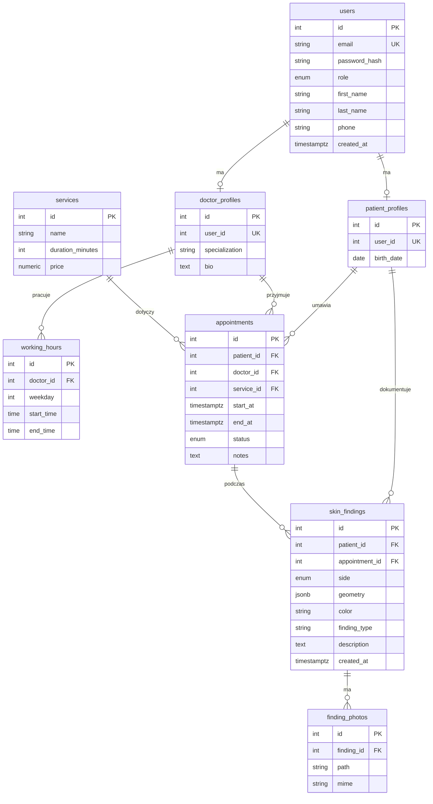

# Schemat bazy (MVP)

`patient_id` i `doctor_id` wskazują na profile, nie na tabelę `users`.

```mermaid
erDiagram
    users ||--o| patient_profiles : ma
    users ||--o| doctor_profiles : ma
    doctor_profiles ||--o{ working_hours : pracuje
    patient_profiles ||--o{ appointments : umawia
    doctor_profiles ||--o{ appointments : przyjmuje
    services ||--o{ appointments : dotyczy
    patient_profiles ||--o{ skin_findings : dokumentuje
    appointments ||--o{ skin_findings : podczas
    skin_findings ||--o{ finding_photos : ma

    users {
        int id PK
        string email UK
        string password_hash
        enum role
        string first_name
        string last_name
        string phone
        timestamptz created_at
    }
    patient_profiles {
        int id PK
        int user_id UK
        date birth_date
    }
    doctor_profiles {
        int id PK
        int user_id UK
        string specialization
        text bio
    }
    working_hours {
        int id PK
        int doctor_id FK
        int weekday
        time start_time
        time end_time
    }
    services {
        int id PK
        string name
        int duration_minutes
        numeric price
    }
    appointments {
        int id PK
        int patient_id FK
        int doctor_id FK
        int service_id FK
        timestamptz start_at
        timestamptz end_at
        enum status
        text notes
    }
    skin_findings {
        int id PK
        int patient_id FK
        int appointment_id FK
        enum side
        jsonb geometry
        string color
        string finding_type
        text description
        timestamptz created_at
    }
    finding_photos {
        int id PK
        int finding_id FK
        string path
        string mime
    }
```

Indeksy: unikalny `users.email`, indeks `appointments (doctor_id, start_at)`.
